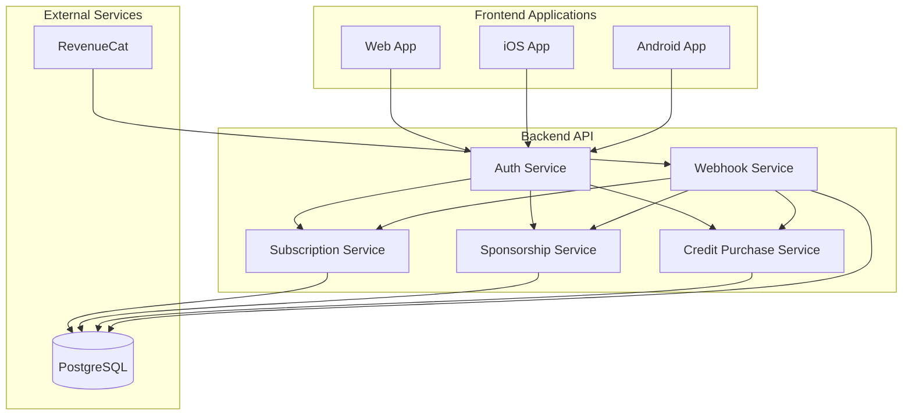
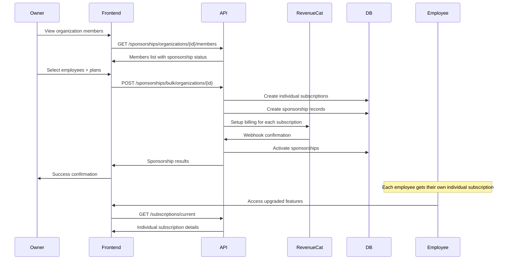
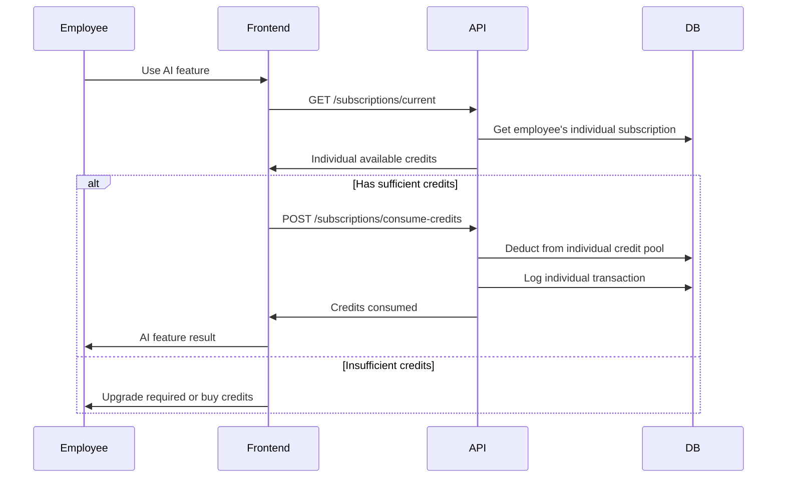

# Subscription and Employee Subscription System Flow

## Overview

The WooCommerce Store Management App implements a comprehensive subscription system with two main types:
1. **Personal Subscriptions** - Individual user subscriptions (self-paid)
2. **Sponsored Employee Subscriptions** - Individual subscriptions sponsored by organization owners

The system integrates with RevenueCat for payment processing and includes a dual-credit system with monthly and purchased credits. **Each user has their own individual subscription and credit pool.**

## System Architecture



## Subscription Types and Plans

### Personal Subscriptions (Self-Paid)

| Plan | Monthly Credits | Price | AI Features | Description |
|------|----------------|-------|-------------|-------------|
| TRIAL | 50 credits | Free | ✅ | 14-day trial with full AI access |
| PRO | 0 credits | $9.99/month | ❌ | Basic store management, no AI |
| AI | 100 credits | $19.99/month | ✅ | Full AI features + monthly credits |

### Sponsored Employee Subscriptions

Organization owners can sponsor individual subscriptions for their employees:

- **Available Plans**: PRO ($9.99/month) or AI ($19.99/month)
- **Individual Credits**: Each employee gets their own credit pool
- **Separate Billing**: Each employee subscription is billed separately to the sponsor
- **Full Independence**: Employees have complete control over their individual credits

## Credit System

### Credit Types

1. **Monthly Credits** - Reset every billing period (AI plan only)
2. **Purchased Credits** - Never expire, can be bought additionally

### Credit Usage Rules

- Each user has their own individual credit pool
- Only **AI Plan** and **TRIAL** subscribers can use credits
- **PRO Plan** subscribers have 0 credits and no AI access
- Credits are **NOT shared** - each subscription is independent
- All credit usage is logged for individual audit trails


## Flow Diagrams

### 1. Employee Subscription Sponsorship Flow 



### 2. Individual Employee Credit Usage Flow 



## Frontend API Integration

### 1. Personal Subscription Management (Updated)

```typescript
// Get current user's individual subscription
const getPersonalSubscription = async () => {
  const response = await api.get('/subscriptions/current');
  return response.data;
};

// Consume credits from individual subscription
const consumeCredits = async (credits: number, description: string) => {
  const response = await api.post('/subscriptions/consume-credits', {
    credits,
    description,
    metadata: { feature: 'ai-optimization' }
  });
  return response.data;
};

// Purchase additional credits for individual subscription
const purchaseCredits = async (creditPackage: string) => {
  const response = await api.post('/subscriptions/purchase-credits', {
    package: creditPackage
  });
  return response.data;
};
```

### 2. Employee Sponsorship Management (New)

```typescript
// Get organization members for sponsorship
const getOrganizationMembers = async (organizationId: string, filters?: any) => {
  const response = await api.get(
    `/sponsorships/organizations/${organizationId}/members`,
    { params: filters }
  );
  return response.data;
};

// Create bulk employee sponsorships
const createBulkSponsorship = async (
  organizationId: string,
  sponsorshipData: CreateBulkSponsorshipRequest
) => {
  const response = await api.post(
    `/sponsorships/bulk/organizations/${organizationId}`,
    sponsorshipData
  );
  return response.data;
};

// Get sponsored employees for an organization
const getSponsoredEmployees = async (organizationId: string) => {
  const response = await api.get(
    `/sponsorships/organizations/${organizationId}/sponsored`
  );
  return response.data;
};

// Cancel employee sponsorship
const cancelSponsorship = async (sponsorshipId: string) => {
  const response = await api.delete(`/sponsorships/${sponsorshipId}`);
  return response.data;
};

// Get sponsorship billing summary
const getSponsorshipBilling = async (organizationId: string) => {
  const response = await api.get(
    `/sponsorships/organizations/${organizationId}/billing`
  );
  return response.data;
};
```

### 3. Frontend Component Example (Updated)

```typescript
// SubscriptionManager.tsx
const SubscriptionManager = () => {
  const [currentSubscription, setCurrentSubscription] = useState(null);
  const [sponsorshipInfo, setSponsorshipInfo] = useState(null);
  const { user, activeOrganization } = useAuth();

  useEffect(() => {
    loadSubscriptionData();
  }, [user, activeOrganization]);

  const loadSubscriptionData = async () => {
    // Load user's individual subscription
    const subscription = await getPersonalSubscription();
    setCurrentSubscription(subscription);

    // Check if current subscription is sponsored
    if (subscription.sponsorshipId) {
      const sponsorship = await getSponsorshipInfo(subscription.sponsorshipId);
      setSponsorshipInfo(sponsorship);
    }
  };

  const handleAIFeatureRequest = async (credits: number) => {
    // Use individual subscription credits
    if (currentSubscription && currentSubscription.availableCredits >= credits) {
      return await consumeCredits(credits, 'AI feature usage');
    } else {
      throw new Error('Insufficient credits. Please upgrade or purchase more credits.');
    }
  };

  const handleBuyCredits = async (package: string) => {
    await purchaseCredits(package);
    await loadSubscriptionData(); // Refresh data
  };

  return (
    <div>
      {/* Individual subscription UI */}
      <SubscriptionCard 
        subscription={currentSubscription}
        sponsorshipInfo={sponsorshipInfo}
        onBuyCredits={handleBuyCredits}
        onUpgrade={handleUpgrade}
      />
      
      {/* Sponsorship management (for organization owners) */}
      {user.role === 'OWNER' && activeOrganization && (
        <SponsorshipManager 
          organizationId={activeOrganization.id}
          onCreateSponsorship={handleCreateSponsorship}
        />
      )}
    </div>
  );
};

// SponsorshipManager.tsx (New Component)
const SponsorshipManager = ({ organizationId, onCreateSponsorship }) => {
  const [members, setMembers] = useState([]);
  const [sponsoredEmployees, setSponsoredEmployees] = useState([]);
  const [billingInfo, setBillingInfo] = useState(null);

  useEffect(() => {
    loadSponsorshipData();
  }, [organizationId]);

  const loadSponsorshipData = async () => {
    const [membersData, sponsoredData, billingData] = await Promise.all([
      getOrganizationMembers(organizationId),
      getSponsoredEmployees(organizationId),
      getSponsorshipBilling(organizationId)
    ]);
    
    setMembers(membersData);
    setSponsoredEmployees(sponsoredData);
    setBillingInfo(billingData);
  };

  const handleSponsorEmployees = async (selectedEmployees, plan) => {
    const sponsorshipData = {
      employees: selectedEmployees,
      plan: plan // 'PRO' or 'AI'
    };
    
    await onCreateSponsorship(organizationId, sponsorshipData);
    await loadSponsorshipData(); // Refresh data
  };

  return (
    <div>
      <h3>Sponsor Employee Subscriptions</h3>
      
      {/* Available members to sponsor */}
      <MemberSelection 
        members={members}
        onSponsor={handleSponsorEmployees}
      />
      
      {/* Currently sponsored employees */}
      <SponsoredEmployeesList 
        employees={sponsoredEmployees}
        onCancel={cancelSponsorship}
      />
      
      {/* Billing summary */}
      <BillingSummary billing={billingInfo} />
    </div>
  );
};
```

## Request/Response Types (Updated)

```typescript
// Sponsorship-related types
interface CreateBulkSponsorshipRequest {
  employees: Array<{
    userId: string;
    plan: 'PRO' | 'AI';
  }>;
}

interface SponsorshipInfo {
  id: string;
  sponsorUserId: string;
  sponsorOrganizationName: string;
  sponsoredUserId: string;
  plan: 'PRO' | 'AI';
  monthlyCost: number;
  isActive: boolean;
  sponsoredAt: string;
}

interface BillingInfo {
  totalMonthlyCost: number;
  activeSponsorship: number;
  nextBillingDate: string;
  billingHistory: BillingRecord[];
}

interface IndividualSubscription {
  id: string;
  userId: string;
  plan: 'TRIAL' | 'PRO' | 'AI';
  status: string;
  totalCredits: number;
  usedCredits: number;
  availableCredits: number;
  purchasedCredits: number;
  isSponsored: boolean;
  sponsorshipInfo?: SponsorshipInfo;
  currentPeriodEnd: string;
}
```

## Security and Authorization (Updated)

### Role-Based Access Control

| Action | Required Permission | Notes |
|--------|-------------------|-------|
| Create personal subscription | `subscription:create` | User owns subscription |
| View personal subscription | `subscription:read` | User owns subscription |
| Consume individual credits | `subscription:use` | User owns subscription |
| Sponsor employee subscriptions | `organization:owner` | Organization owner only |
| View sponsorship billing | `organization:owner` | Organization owner only |
| Cancel sponsorship | `organization:owner` | Organization owner only |
| View individual usage | `subscription:read` | User owns subscription |


## ✅ New Features:
- Individual subscriptions for each employee
- Sponsorship relationship tracking
- Individual billing per sponsored employee
- Separate credit pools for each user
- Sponsorship management dashboard
- Individual usage tracking

### 📊 Benefits:
1. **Simplified Credit Management**: Each user manages their own credits
2. **Better Usage Tracking**: Individual audit trails per user
3. **Flexible Sponsorship**: Owners can sponsor different plans for different employees
4. **Scalable Billing**: Each sponsorship is billed separately
5. **User Independence**: Employees have full control over their individual subscriptions

This redesigned system maintains the same core functionality while providing true individual subscriptions for each user, whether self-paid or sponsored by an organization owner.


#Schema 

// Subscription Management System Schema
// This schema focuses on individual subscriptions and employee sponsorship system

// User Model - Represents all users in the system
model User {
  id            String    @id @default(uuid()) @db.Uuid
  name          String?
  email         String    @unique
  emailVerified Boolean   @default(false)
  image         String?
  password      String?
  createdAt     DateTime  @default(now())
  updatedAt     DateTime  @updatedAt

  // Individual subscriptions owned by this user (each user has their own subscription)
  subscriptions                   Subscription[]
  
  // Credit-related activities for this user
  creditPurchases                 CreditPurchase[]
  creditTransactions              CreditTransaction[]
  
  // Sponsorship relationships
  sponsoredSubscriptions          EmployeeSubscriptionSponsorship[] @relation("SponsorUser") // Sponsorships they pay for (as organization owner)
  receivedSponsoredSubscriptions  EmployeeSubscriptionSponsorship[] @relation("SponsoredUser") // Sponsorships they receive (as employee)
}

// Organization Model - Represents companies/organizations
model Organization {
  id        String   @id @default(uuid()) @db.Uuid
  name      String
  slug      String   @unique
  logo      String?
  createdAt DateTime @default(now())

  // Subscription-related activities within this organization
  creditPurchases                  CreditPurchase[]
  creditTransactions               CreditTransaction[]
  employeeSubscriptionSponsorships EmployeeSubscriptionSponsorship[]
}

// Individual Subscription Model - Each user has their own separate subscription
// This is the core model representing individual subscription ownership
model Subscription {
  id                    String              @id @default(uuid()) @db.Uuid
  userId                String              @db.Uuid // The user who owns this subscription
  revenueCatCustomerId  String?             @unique  // RevenueCat customer ID (nullable for trial subscriptions)
  plan                  SubscriptionPlan    // TRIAL, PRO, or AI
  status                SubscriptionStatus  // ACTIVE, TRIALING, CANCELED, etc.
  billingPeriod         Int                 @default(1)  // 1, 6, or 12 months (14 days for trial)
  currentPeriodStart    DateTime           // When current billing period started
  currentPeriodEnd      DateTime           // When current billing period ends
  totalCredits          Int                 @default(0)  // Total credits allocated for current billing period
  usedCredits           Int                 @default(0)  // Credits consumed in current period
  purchasedCredits      Int                 @default(0)  // Additional purchased credits (never expire)
  isActive              Boolean             @default(true) // Whether subscription is currently active
  createdAt             DateTime            @default(now())
  updatedAt             DateTime            @updatedAt

  // Relationships
  user                            User                             @relation(fields: [userId], references: [id], onDelete: Cascade)
  creditPurchases                 CreditPurchase[]                // Credit purchases made for this subscription
  creditTransactions              CreditTransaction[]             // All credit transactions for this subscription
  employeeSubscriptionSponsorship EmployeeSubscriptionSponsorship? // Optional sponsorship info if this subscription is sponsored

  @@index([userId])
  @@index([status])
  @@index([plan])
}

// Employee Subscription Sponsorship - Tracks when organization owners sponsor employee subscriptions
// This model creates the relationship between sponsor (owner), sponsored user (employee), and their individual subscription
// 💡 TIP: Consider using environment variable DISCOUNT for employee subscriptions to apply bulk discounts
model EmployeeSubscriptionSponsorship {
  id               String          @id @default(uuid()) @db.Uuid
  subscriptionId   String          @unique @db.Uuid // One-to-one relationship with the sponsored subscription
  sponsorUserId    String          @db.Uuid // Organization owner who pays for the subscription
  sponsoredUserId  String          @db.Uuid // Employee who receives the sponsored subscription
  organizationId   String          @db.Uuid // Organization context for this sponsorship
  plan             SubscriptionPlan // The plan being sponsored (PRO or AI)
  monthlyCost      Decimal         @db.Decimal(10,2) // Cost per month for this sponsorship (consider applying DISCOUNT env variable)
  discountApplied  Decimal?        @db.Decimal(5,2) // Percentage discount applied (e.g., 0.15 for 15% off)
  originalPrice    Decimal         @db.Decimal(10,2) // Original price before discount
  isActive         Boolean         @default(true) // Whether sponsorship is currently active
  sponsoredAt      DateTime        @default(now()) // When sponsorship started
  cancelledAt      DateTime? // When sponsorship was cancelled (if applicable)
  createdAt        DateTime        @default(now())
  updatedAt        DateTime        @updatedAt

  // Relationships
  subscription     Subscription     @relation(fields: [subscriptionId], references: [id], onDelete: Cascade)
  sponsorUser      User             @relation("SponsorUser", fields: [sponsorUserId], references: [id], onDelete: Cascade)
  sponsoredUser    User             @relation("SponsoredUser", fields: [sponsoredUserId], references: [id], onDelete: Cascade)
  organization     Organization     @relation(fields: [organizationId], references: [id], onDelete: Cascade)
  billingRecords   SponsorshipBilling[] // Individual billing records for this sponsorship

  // Ensure one sponsorship per employee per organization per sponsor
  @@unique([sponsoredUserId, organizationId, sponsorUserId])
  @@index([sponsorUserId])
  @@index([sponsoredUserId])
  @@index([organizationId])
  @@index([isActive])
}

// Sponsorship Billing - Individual billing records for each sponsored subscription
// Tracks payment history and billing cycles for sponsored employee subscriptions
// 💡 TIP: Amount should reflect discounted price when DISCOUNT environment variable is applied
model SponsorshipBilling {
  id                      String   @id @default(uuid()) @db.Uuid
  sponsorshipId           String   @db.Uuid // Links to the sponsorship being billed
  sponsorUserId           String   @db.Uuid // Who is being charged
  billingPeriodStart      DateTime // Start of billing period
  billingPeriodEnd        DateTime // End of billing period
  amount                  Decimal  @db.Decimal(10,2) // Final amount charged (after discount applied)
  originalAmount          Decimal? @db.Decimal(10,2) // Original amount before discount
  discountAmount          Decimal? @db.Decimal(10,2) // Amount saved due to discount
  status                  String   @default("pending") // pending, paid, failed, refunded
  revenueCatTransactionId String? // RevenueCat transaction reference
  createdAt               DateTime @default(now())
  updatedAt               DateTime @updatedAt

  // Relationships
  sponsorship EmployeeSubscriptionSponsorship @relation(fields: [sponsorshipId], references: [id], onDelete: Cascade)

  @@index([sponsorUserId])
  @@index([sponsorshipId])
  @@index([status])
  @@index([billingPeriodStart])
}

// Credit Package - Defines available credit packages for purchase
// Represents different credit bundles users can buy to supplement their monthly allocation
model CreditPackage {
  id                    String   @id @default(uuid()) @db.Uuid
  name                  String   // Display name (e.g., "Starter Pack", "Power User Bundle")
  credits               Int      // Number of credits in this package
  price                 Int      // Price in cents (e.g., 999 = $9.99)
  currency              String   @default("USD")
  revenueCatProductId   String   @unique // RevenueCat product identifier
  isActive              Boolean  @default(true) // Whether this package is currently available for purchase
  sortOrder             Int      @default(0) // Display order in the UI
  createdAt             DateTime @default(now())
  updatedAt             DateTime @updatedAt

  // Relationships
  creditPurchases CreditPurchase[] // All purchases of this package

  @@index([isActive])
  @@index([sortOrder])
}

// Credit Purchase - Records when users purchase additional credits
// Tracks individual credit purchase transactions beyond monthly allocations
model CreditPurchase {
  id                      String         @id @default(uuid()) @db.Uuid
  userId                  String         @db.Uuid // User who made the purchase
  organizationId          String         @db.Uuid // Organization context for the purchase
  subscriptionId          String         @db.Uuid // Which subscription the credits are added to
  creditPackageId         String         @db.Uuid // Which credit package was purchased
  revenueCatTransactionId String         @unique // RevenueCat transaction reference
  credits                 Int            // Number of credits purchased
  price                   Int            // Amount paid in cents
  currency                String         @default("USD")
  status                  PurchaseStatus // PENDING, COMPLETED, FAILED, REFUNDED
  purchasedAt             DateTime       // When the purchase was made
  refundedAt              DateTime?      // When refunded (if applicable)
  createdAt               DateTime       @default(now())
  updatedAt               DateTime       @updatedAt

  // Relationships
  user          User          @relation(fields: [userId], references: [id], onDelete: Cascade)
  organization  Organization  @relation(fields: [organizationId], references: [id], onDelete: Cascade)
  subscription  Subscription  @relation(fields: [subscriptionId], references: [id], onDelete: Cascade)
  creditPackage CreditPackage @relation(fields: [creditPackageId], references: [id], onDelete: Cascade)

  @@index([userId])
  @@index([organizationId])
  @@index([subscriptionId])
  @@index([status])
  @@index([purchasedAt])
}

// Credit Transaction - Audit trail of all credit movements
// Provides complete history of credit allocations, consumption, and adjustments for each user
model CreditTransaction {
  id              String                @id @default(uuid()) @db.Uuid
  userId          String                @db.Uuid // User whose credits were affected
  organizationId  String                @db.Uuid // Organization context
  subscriptionId  String?               @db.Uuid // Related subscription (nullable for system transactions)
  type            CreditTransactionType // Type of transaction (see enum below)
  amount          Int                   // Credit change amount (positive for additions, negative for consumption)
  description     String                // Human-readable description of the transaction
  metadata        Json?                 // Additional data (feature used, AI model, etc.)
  createdAt       DateTime              @default(now())

  // Relationships
  user         User          @relation(fields: [userId], references: [id], onDelete: Cascade)
  organization Organization  @relation(fields: [organizationId], references: [id], onDelete: Cascade)
  subscription Subscription? @relation(fields: [subscriptionId], references: [id], onDelete: SetNull)

  @@index([userId])
  @@index([organizationId])
  @@index([subscriptionId])
  @@index([type])
  @@index([createdAt])
}

// Enums

// Subscription Plans Available
enum SubscriptionPlan {
  TRIAL // 14-day free trial with 50 AI credits
  PRO   // $9.99/month - Basic features, no AI credits
  AI    // $19.99/month - Full features with 100 monthly AI credits
}

// Subscription Status States
enum SubscriptionStatus {
  ACTIVE     // Subscription is active and user has access
  TRIALING   // User is in trial period
  PAST_DUE   // Payment failed but still have access
  CANCELED   // Subscription cancelled but may still have access until period end
  UNPAID     // Payment failed and access is restricted
  PAUSED     // Subscription temporarily paused
}

// Credit Purchase Status
enum PurchaseStatus {
  PENDING   // Purchase initiated but not yet confirmed
  COMPLETED // Purchase successful and credits added
  FAILED    // Purchase failed
  REFUNDED  // Purchase was refunded and credits removed
}

// Types of Credit Transactions for Audit Trail
enum CreditTransactionType {
  TRIAL_ALLOCATION  // Credits allocated when user starts trial
  PERIOD_ALLOCATION // Monthly credits allocated at billing cycle
  PURCHASED         // Credits added from purchase
  CONSUMED          // Credits used for AI features
  REFUNDED          // Credits added back due to refund
  EXPIRED           // Credits removed due to expiration (if implemented)
}