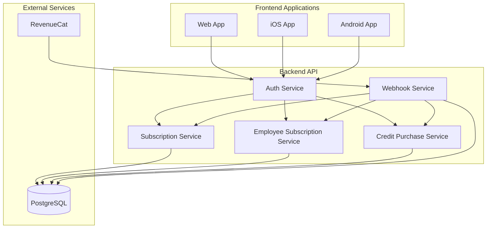
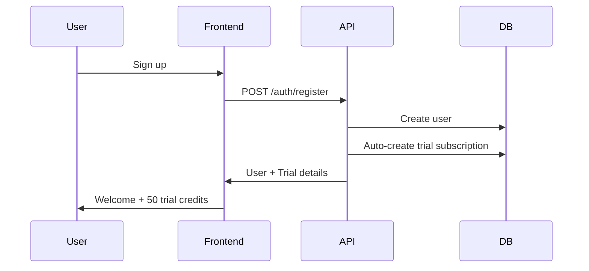
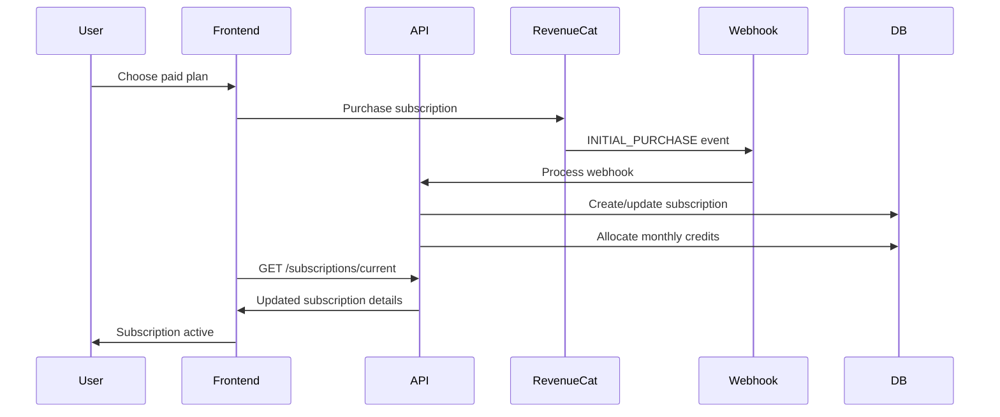
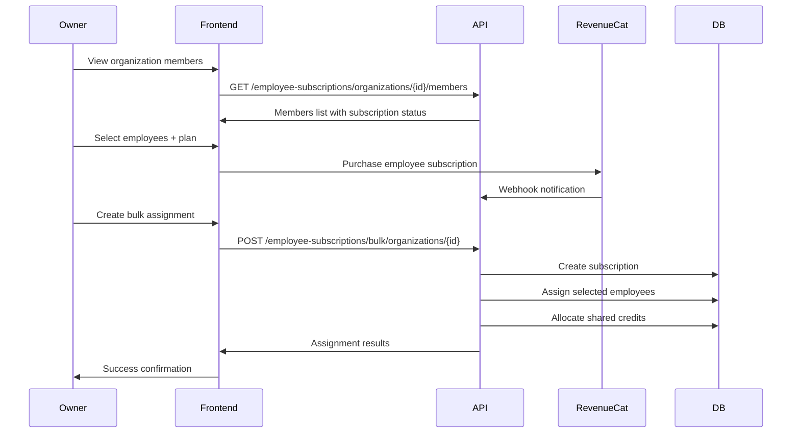
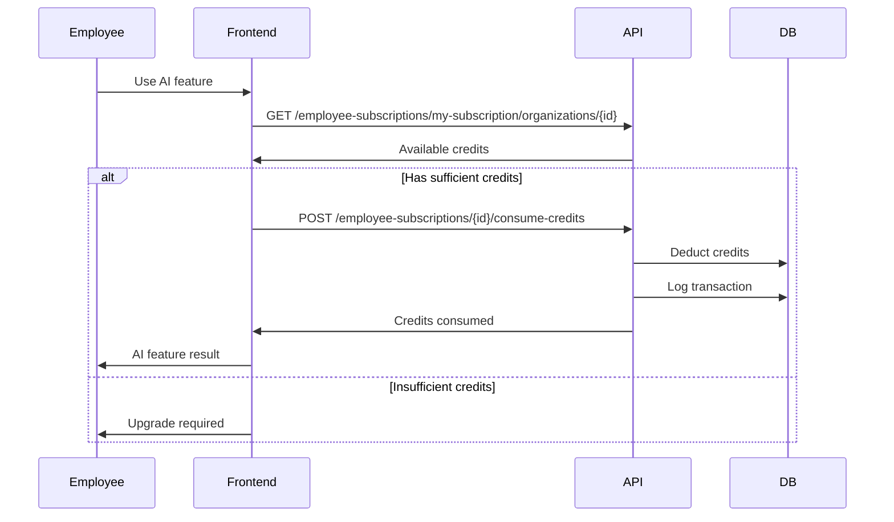

# Subscription and Employee Subscription System Flow

## Overview

The WooCommerce Store Management App implements a comprehensive subscription system with two main types:
1. **Personal Subscriptions** - Individual user subscriptions
2. **Employee Subscriptions** - Organization-sponsored subscriptions for employees

The system integrates with RevenueCat for payment processing and includes a dual-credit system with monthly and purchased credits.

## System Architecture



## Subscription Types and Plans

### Personal Subscriptions

| Plan | Monthly Credits | Price | AI Features | Description |
|------|----------------|-------|-------------|-------------|
| TRIAL | 50 credits | Free | ✅ | 14-day trial with full AI access |
| PRO | 0 credits | $9.99/month | ❌ | Basic store management, no AI |
| AI | 100 credits | $19.99/month | ✅ | Full AI features + monthly credits |

### Employee Subscriptions

Employee subscriptions are **AI or TRIAL plans only** sponsored by organization owners for their team members.

- **Sponsor**: Organization owner pays for the subscription
- **Beneficiaries**: Organization employees get access to AI features
- **Shared Credits**: All employees share the monthly credit pool
- **Max Employees**: Configurable limit per subscription

## Credit System

### Credit Types

1. **Monthly Credits** - Reset every billing period
2. **Purchased Credits** - Never expire, can be bought additionally

### Credit Usage Priority

Credits are consumed in this order:
1. Monthly credits first
2. Purchased credits second

### Credit Rules

- Only **AI Plan** and **TRIAL** subscribers can use credits
- **PRO Plan** subscribers have 0 credits and no AI access
- Credits are shared in employee subscriptions
- All credit usage is logged for audit trails

## Complete Flow Diagrams

### 1. User Registration and Trial Flow



### 2. Personal Subscription Upgrade Flow



### 3. Employee Subscription Creation Flow



### 4. Employee Credit Usage Flow



## Frontend API Integration

### 1. Authentication Setup

```typescript
// Initialize with current user context
const currentUser = await getCurrentUser();
const activeOrganization = await getActiveOrganization();
```

### 2. Personal Subscription Management

```typescript
// Get current subscription status
const getPersonalSubscription = async () => {
  const response = await api.get('/subscriptions/current');
  return response.data;
};

// Create trial subscription
const startTrial = async () => {
  const response = await api.post('/subscriptions/trial');
  return response.data;
};

// Convert trial to paid
const upgradeToPaid = async (subscriptionData: CreateSubscriptionRequest) => {
  const response = await api.post('/subscriptions/trial/convert', subscriptionData);
  return response.data;
};

// Consume credits from personal subscription
const consumePersonalCredits = async (credits: number, description: string) => {
  const response = await api.post('/subscriptions/consume-credits', {
    credits,
    description,
    metadata: { feature: 'ai-optimization' }
  });
  return response.data;
};
```

### 3. Employee Subscription Management

```typescript
// Get organization members for subscription assignment
const getOrganizationMembers = async (organizationId: string, filters?: any) => {
  const response = await api.get(
    `/employee-subscriptions/organizations/${organizationId}/members`,
    { params: filters }
  );
  return response.data;
};

// Create bulk employee subscription
const createBulkEmployeeSubscription = async (
  organizationId: string,
  subscriptionData: CreateBulkEmployeeSubscriptionRequest
) => {
  const response = await api.post(
    `/employee-subscriptions/bulk/organizations/${organizationId}`,
    subscriptionData
  );
  return response.data;
};

// Get employee's subscription for organization
const getEmployeeSubscription = async (organizationId: string) => {
  const response = await api.get(
    `/employee-subscriptions/my-subscription/organizations/${organizationId}`
  );
  return response.data;
};

// Consume credits from employee subscription
const consumeEmployeeCredits = async (
  subscriptionId: string,
  organizationId: string,
  credits: number,
  description: string
) => {
  const response = await api.post(
    `/employee-subscriptions/${subscriptionId}/consume-credits`,
    {
      organizationId,
      credits,
      description,
      metadata: { feature: 'ai-analysis' }
    }
  );
  return response.data;
};
```

### 4. Frontend Component Example

```typescript
// SubscriptionManager.tsx
const SubscriptionManager = () => {
  const [personalSub, setPersonalSub] = useState(null);
  const [employeeSubs, setEmployeeSubs] = useState([]);
  const { user, activeOrganization } = useAuth();

  useEffect(() => {
    loadSubscriptions();
  }, [user, activeOrganization]);

  const loadSubscriptions = async () => {
    // Load personal subscription
    const personal = await getPersonalSubscription();
    setPersonalSub(personal);

    // Load employee subscriptions
    if (activeOrganization) {
      const employee = await getEmployeeSubscription(activeOrganization.id);
      setEmployeeSubs(employee ? [employee] : []);
    }
  };

  const handleAIFeatureRequest = async (credits: number) => {
    // Try employee subscription first, then personal
    if (employeeSubs.length > 0 && employeeSubs[0].availableCredits >= credits) {
      return await consumeEmployeeCredits(
        employeeSubs[0].id,
        activeOrganization.id,
        credits,
        'AI feature usage'
      );
    } else if (personalSub && personalSub.availableCredits >= credits) {
      return await consumePersonalCredits(credits, 'AI feature usage');
    } else {
      throw new Error('Insufficient credits');
    }
  };

  return (
    <div>
      {/* Personal subscription UI */}
      {personalSub && (
        <SubscriptionCard 
          subscription={personalSub}
          type="personal"
          onUpgrade={handleUpgrade}
        />
      )}

      {/* Employee subscription UI */}
      {employeeSubs.map(sub => (
        <SubscriptionCard
          key={sub.id}
          subscription={sub}
          type="employee"
          sponsorName={sub.sponsorOrganizationName}
        />
      ))}
    </div>
  );
};
```

## RevenueCat Integration

### Webhook Events Handled

| Event | Description | Action |
|-------|-------------|--------|
| `INITIAL_PURCHASE` | New subscription | Create subscription record |
| `RENEWAL` | Subscription renewed | Reset monthly credits |
| `CANCELLATION` | Subscription cancelled | Mark as inactive |
| `UNCANCELLATION` | Subscription reactivated | Mark as active |
| `NON_RENEWING_PURCHASE` | Credit purchase | Add purchased credits |
| `EXPIRATION` | Subscription expired | Deactivate subscription |
| `BILLING_ISSUE` | Payment failed | Mark payment issue |

### Webhook Security

```typescript
// Webhook signature verification
const verifyWebhookSignature = (
  payload: string,
  signature: string,
  secret: string
): boolean => {
  const expectedSignature = crypto
    .createHmac('sha256', secret)
    .update(payload)
    .digest('hex');
  
  return crypto.timingSafeEqual(
    Buffer.from(signature),
    Buffer.from(expectedSignature)
  );
};
```

### RevenueCat Configuration

```typescript
// Frontend - RevenueCat SDK initialization
import Purchases from '@revenuecat/purchases-js';

// Initialize RevenueCat
await Purchases.configure({
  apiKey: process.env.REVENUECAT_PUBLIC_API_KEY,
  userId: currentUser.id
});

// Purchase subscription
const purchaseSubscription = async (productId: string) => {
  try {
    const result = await Purchases.purchaseProduct(productId);
    return result;
  } catch (error) {
    console.error('Purchase failed:', error);
    throw error;
  }
};
```

## Database Schema

### Core Tables

```sql
-- Subscriptions (both personal and employee)
CREATE TABLE subscriptions (
  id UUID PRIMARY KEY,
  user_id UUID NOT NULL, -- Owner/payer
  revenue_cat_customer_id VARCHAR UNIQUE,
  plan subscription_plan NOT NULL,
  status subscription_status NOT NULL,
  billing_period INTEGER DEFAULT 1,
  current_period_start TIMESTAMP NOT NULL,
  current_period_end TIMESTAMP NOT NULL,
  total_credits INTEGER DEFAULT 0,
  used_credits INTEGER DEFAULT 0,
  purchased_credits INTEGER DEFAULT 0,
  is_active BOOLEAN DEFAULT true,
  is_employee_subscription BOOLEAN DEFAULT false,
  sponsor_organization_id UUID, -- For employee subscriptions
  max_employees INTEGER,
  created_at TIMESTAMP DEFAULT NOW(),
  updated_at TIMESTAMP DEFAULT NOW()
);

-- Employee subscription assignments
CREATE TABLE employee_subscriptions (
  id UUID PRIMARY KEY,
  subscription_id UUID NOT NULL,
  user_id UUID NOT NULL, -- Employee
  organization_id UUID NOT NULL,
  is_active BOOLEAN DEFAULT true,
  assigned_at TIMESTAMP DEFAULT NOW(),
  revoked_at TIMESTAMP,
  created_at TIMESTAMP DEFAULT NOW(),
  updated_at TIMESTAMP DEFAULT NOW(),
  
  UNIQUE(subscription_id, user_id, organization_id)
);

-- Credit transaction audit trail
CREATE TABLE credit_transactions (
  id UUID PRIMARY KEY,
  user_id UUID NOT NULL,
  organization_id UUID,
  subscription_id UUID NOT NULL,
  type credit_transaction_type NOT NULL,
  amount INTEGER NOT NULL, -- Negative for consumption
  description TEXT NOT NULL,
  metadata JSONB,
  created_at TIMESTAMP DEFAULT NOW()
);
```

## Security and Authorization

### Role-Based Access Control

| Action | Required Permission | Notes |
|--------|-------------------|-------|
| Create personal subscription | `subscription:create` | User owns subscription |
| View personal subscription | `subscription:read` | User owns subscription |
| Consume personal credits | `subscription:use` | User owns subscription |
| Create employee subscription | `organization:owner` | Organization owner only |
| Assign employees | `organization:owner` | Organization owner only |
| View usage reports | `organization:owner` | Organization owner only |
| Consume employee credits | Employee assignment | Must be assigned to subscription |

### API Security

```typescript
// Authentication required for all endpoints
@UseGuards(AuthGuard, PermissionGuard)
@Controller('subscriptions')
export class SubscriptionController {

  @RequirePermissions('subscription:create')
  @Post()
  async createSubscription(@CurrentUser() user: UserEntity) {
    // Implementation
  }

  @RequirePermissions('organization:owner')
  @Post('bulk/organizations/:organizationId')
  async createBulkEmployeeSubscription() {
    // Implementation
  }
}
```

## Error Handling and Edge Cases

### Common Error Scenarios

1. **Insufficient Credits**
   ```typescript
   if (availableCredits < requestedCredits) {
     throw new BadRequestException('Insufficient credits');
   }
   ```

2. **Invalid Employee Assignment**
   ```typescript
   if (!employeeMember) {
     throw new BadRequestException(
       'User is not a member of the target organization'
     );
   }
   ```

3. **Subscription Limits**
   ```typescript
   if (currentAssignments >= maxEmployees) {
     throw new BadRequestException(
       `Maximum employee limit (${maxEmployees}) reached`
     );
   }
   ```

4. **Plan Restrictions**
   ```typescript
   if (subscription.plan === SubscriptionPlan.PRO) {
     throw new ForbiddenException('PRO plan subscribers cannot use AI credits');
   }
   ```

### Frontend Error Handling

```typescript
const handleSubscriptionAction = async (action: () => Promise<any>) => {
  try {
    return await action();
  } catch (error) {
    switch (error.status) {
      case 400:
        toast.error('Invalid request: ' + error.message);
        break;
      case 403:
        toast.error('Access denied: ' + error.message);
        break;
      case 404:
        toast.error('Subscription not found');
        break;
      default:
        toast.error('Something went wrong. Please try again.');
    }
    throw error;
  }
};
```

## Monitoring and Analytics

### Key Metrics to Track

1. **Subscription Metrics**
   - Trial to paid conversion rate
   - Monthly recurring revenue (MRR)
   - Customer lifetime value (CLV)
   - Churn rate

2. **Credit Usage Metrics**
   - Average credits per user per month
   - Most popular AI features
   - Credit purchase patterns

3. **Employee Subscription Metrics**
   - Average employees per subscription
   - Organization adoption rate
   - Shared credit utilization

### Logging and Audit Trail

```typescript
// All credit transactions are logged
await this.prisma.creditTransaction.create({
  data: {
    userId,
    organizationId,
    subscriptionId,
    type: 'CONSUMED',
    amount: -credits,
    description: 'AI feature usage',
    metadata: { feature: 'product-optimization' }
  }
});
```

## Testing Strategy

### Unit Tests
- Subscription service methods
- Credit calculation logic
- Permission validation
- Webhook processing

### Integration Tests
- Complete subscription flows
- RevenueCat webhook handling
- Database transactions
- API endpoint testing

### E2E Tests
- User registration → trial → upgrade flow
- Organization owner → employee subscription → usage flow
- Payment processing and webhook integration

This comprehensive system provides a robust foundation for managing both individual and organization-based subscriptions with proper credit tracking, security, and integration with RevenueCat payment processing.
